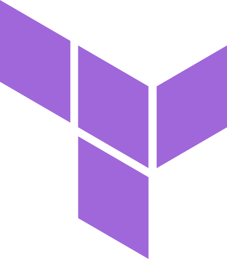
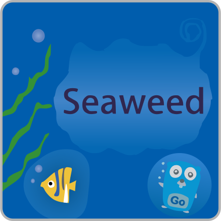
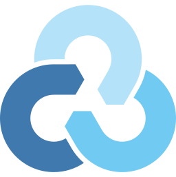

 
<pre><samp>cycneuramus@github:~$ Linux SysOps engineer, FOSS contributor, selfhoster █</samp></pre>
 

## Featured projects

  
  

  
  

  
  

  
  

  
  

  
  

## Projects contributed to

  
  

  
  

  
  

## Technologies

### Distributions

<table>
  <tr>
    <td align="center"> Arch</td>
    <td align="center"> Debian</td>
    <td align="center"> Alpine</td>
    <td align="center"> Rocky</td>
    <td align="center"> Ubuntu</td>
    <td align="center"> Fedora</td>
  </tr>
</table>

### Programming & Scripting Languages

<table>
  <tr>
    <td align="center"> Go</td>
    <td align="center"> Nim</td>
    <td align="center"> Python</td>
    <td align="center"> Bash</td>
    <td align="center"> Lua</td>
  </tr>
</table>

### Orchestration, Virtualization & Containers

<table>
  <tr>
    <td align="center"> Nomad</td>
    <td align="center"> Swarm</td>
    <td align="center"> Podman</td>
    <td align="center"> Docker</td>
    <td align="center"> Incus</td>
  </tr>
</table>

### Network Infrastructure & Security

<table>
  <tr>
    <td align="center"> Caddy</td>
    <td align="center"> HAProxy</td>
    <td align="center"> WireGuard</td>
    <td align="center"> Headscale</td>
    <td align="center"> Fail2ban</td>
    <td align="center"> CrowdSec</td>
  </tr>
</table>

### Infrastructure as Code & CI/CD

<table>
  <tr>
    <td align="center"> Ansible</td>
    <td align="center"> Terraform</td>
    <td align="center"> OpenTofu</td>
    <td align="center"> Github Actions</td>
    <td align="center"> Renovate</td>
  </tr>
</table>

### Version Control & Dev Platforms

<table>
  <tr>
    <td align="center"> Git</td>
    <td align="center"> GitHub</td>
    <td align="center"> GitLab</td>
    <td align="center"> Forgejo</td>
    <td align="center"> Gitea</td>
  </tr>
</table>

### Distributed Storage & Backup

<table>
  <tr>
    <td align="center"> JuiceFS</td>
    <td align="center"> Garage</td>
    <td align="center"> SeaweedFS</td>
    <td align="center"> Rclone</td>
    <td align="center"> Borg</td>
    <td align="center"> Restic</td>
  </tr>
</table>

### Editors

<table>
  <tr>
    <td align="center"> Vim</td>
    <td align="center"> Neovim</td>
  </tr>
</table>
