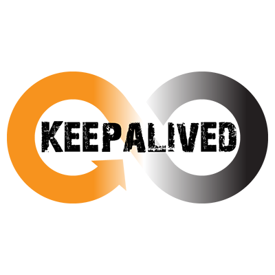
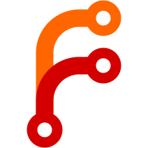

 

<pre><samp>cycneuramus@github:~$ <kbd>cat .profile</kbd>
export WORK="Linux SysOps engineer"
export PLAY="FOSS developer"
export TIMESINK="Self-hoster"

cycneuramus@github:~$ █</samp></pre>

 

<picture>
  <source media="(prefers-color-scheme: dark)" srcset="./assets/cards/trophies-dark.svg">
  <source media="(prefers-color-scheme: light)" srcset="./assets/cards/trophies-light.svg">
  
</picture>

  

## Featured projects

  <a href="https://github.com/cycneuramus/nmgr">
    <picture>
      <source media="(prefers-color-scheme: dark)" srcset="./assets/cards/nmgr-dark.svg">
      <source media="(prefers-color-scheme: light)" srcset="./assets/cards/nmgr-light.svg">
      
    </picture>
  </a>
  <a href="https://github.com/cycneuramus/cloudflare-dns-failover">
    <picture>
      <source media="(prefers-color-scheme: dark)" srcset="./assets/cards/cloudflare-dns-failover-dark.svg">
      <source media="(prefers-color-scheme: light)" srcset="./assets/cards/cloudflare-dns-failover-light.svg">
      
    </picture>
  </a>
  <a href="https://github.com/cycneuramus/deceptimeed">
    <picture>
      <source media="(prefers-color-scheme: dark)" srcset="./assets/cards/deceptimeed-dark.svg">
      <source media="(prefers-color-scheme: light)" srcset="./assets/cards/deceptimeed-light.svg">
      
    </picture>
  </a>
  <a href="https://github.com/cycneuramus/signal-aichat">
    <picture>
      <source media="(prefers-color-scheme: dark)" srcset="./assets/cards/signal-aichat-dark.svg">
      <source media="(prefers-color-scheme: light)" srcset="./assets/cards/signal-aichat-light.svg">
      
    </picture>
  </a>
  <a href="https://github.com/cycneuramus/homelab">
    <picture>
      <source media="(prefers-color-scheme: dark)" srcset="./assets/cards/homelab-dark.svg">
      <source media="(prefers-color-scheme: light)" srcset="./assets/cards/homelab-light.svg">
      
    </picture>
  </a>
  <a href="https://github.com/cycneuramus/ansible-hybrid-cloud">
    <picture>
      <source media="(prefers-color-scheme: dark)" srcset="./assets/cards/ansible-hybrid-cloud-dark.svg">
      <source media="(prefers-color-scheme: light)" srcset="./assets/cards/ansible-hybrid-cloud-light.svg">
      
    </picture>
  </a>

## Contributed to

  <a href="https://github.com/immich-app/immich">
    <picture>
      <source media="(prefers-color-scheme: dark)" srcset="./assets/cards/immich-dark.svg">
      <source media="(prefers-color-scheme: light)" srcset="./assets/cards/immich-light.svg">
      
    </picture>
  </a>
  <a href="https://github.com/rclone/rclone">
    <picture>
      <source media="(prefers-color-scheme: dark)" srcset="./assets/cards/rclone-dark.svg">
      <source media="(prefers-color-scheme: light)" srcset="./assets/cards/rclone-light.svg">
      
    </picture>
  </a>
  <a href="https://github.com/nim-lang/packages">
    <picture>
      <source media="(prefers-color-scheme: dark)" srcset="./assets/cards/packages-dark.svg">
      <source media="(prefers-color-scheme: light)" srcset="./assets/cards/packages-light.svg">
      
    </picture>
  </a>
  <a href="https://github.com/seaweedfs/seaweedfs">
    <picture>
      <source media="(prefers-color-scheme: dark)" srcset="./assets/cards/seaweedfs-dark.svg">
      <source media="(prefers-color-scheme: light)" srcset="./assets/cards/seaweedfs-light.svg">
      
    </picture>
  </a>
  <a href="https://github.com/redlib-org/redlib">
    <picture>
      <source media="(prefers-color-scheme: dark)" srcset="./assets/cards/redlib-dark.svg">
      <source media="(prefers-color-scheme: light)" srcset="./assets/cards/redlib-light.svg">
      
    </picture>
  </a>

 

## Technologies

### Distributions

<table>
  <tr>
    <td align="center"> Arch</td>
    <td align="center"> Debian</td>
    <td align="center"> Alpine</td>
    <td align="center"> Rocky</td>
    <td align="center"> Ubuntu</td>
    <td align="center"> Fedora</td>
  </tr>
</table>

### Programming & Scripting Languages

<table>
  <tr>
    <td align="center"> Go</td>
    <td align="center"> Nim</td>
    <td align="center"> Python</td>
    <td align="center"> Bash</td>
    <td align="center"> Lua</td>
  </tr>
</table>

### Orchestration, Virtualization & Containers

<table>
  <tr>
    <td align="center"> Nomad</td>
    <td align="center"> Swarm</td>
    <td align="center"> Podman</td>
    <td align="center"> Docker</td>
    <td align="center"> Incus</td>
  </tr>
</table>

### Network Infrastructure

<table>
  <tr>
    <td align="center"> Caddy</td>
    <td align="center"> HAProxy</td>
    <td align="center"> OPNsense</td>
    <td align="center"> Unbound</td>
    <td align="center"> Keepalived</td>
  </tr>
</table>

### Network Security

<table>
  <tr>
    <td align="center"> WireGuard</td>
    <td align="center"> Headscale</td>
    <td align="center"> Fail2ban</td>
    <td align="center"> CrowdSec</td>
  </tr>
</table>

### Infrastructure as Code & CI/CD

<table>
  <tr>
    <td align="center"> Ansible</td>
    <td align="center"> Terraform</td>
    <td align="center"> OpenTofu</td>
    <td align="center"> Github Actions</td>
    <td align="center"> Renovate</td>
  </tr>
</table>

### Version Control & Dev Platforms

<table>
  <tr>
    <td align="center"> Git</td>
    <td align="center"> GitHub</td>
    <td align="center"> GitLab</td>
    <td align="center"> Forgejo</td>
    <td align="center"> Gitea</td>
  </tr>
</table>

### Distributed Storage & Backup

<table>
  <tr>
    <td align="center"> JuiceFS</td>
    <td align="center"> Garage</td>
    <td align="center"> SeaweedFS</td>
    <td align="center"> Rclone</td>
    <td align="center"> Borg</td>
    <td align="center"> Restic</td>
  </tr>
</table>

### Editors

<table>
  <tr>
    <td align="center"> Vim</td>
    <td align="center"> Neovim</td>
  </tr>
</table>
